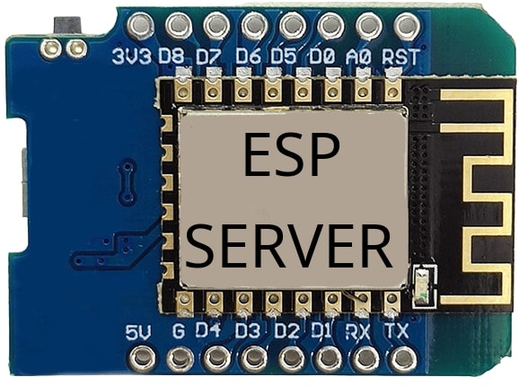
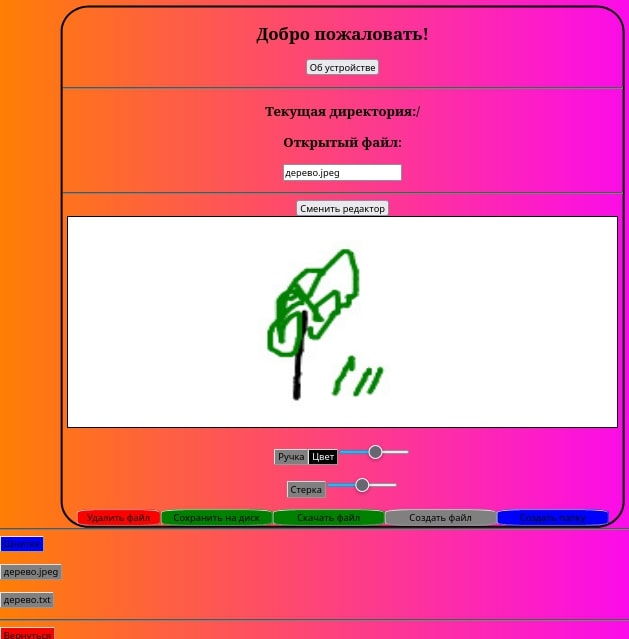
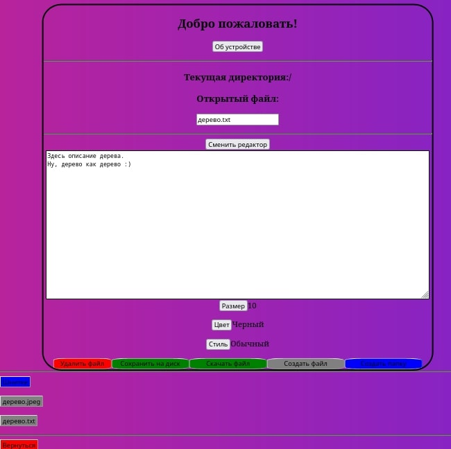

 <h2>Данное ПО позволяет использовать микроконтроллер ESP8266 как мини-сервер для создания, редактирования и удаления текстовых файлов и рисунков.</h2>
 
С этой прошивкой ESP-шка создает точку доступа, превращаясь в локальный сервер.
Следовательно, присутствуют все плюсы локальных серверов:
+ Быстрота

+ Безопасность

+ Не требует интернет

Кроме того, Низкое потребление энергии позволяет запитать сервер от любой зарядки.
Благодаря этому, можно развернуть свой сервер даже в полной изоляции от мира (в лесу, в глухой деревне, в апокалипсис и тд.) используя powerbanr в качестве источника питания. 
<h3>Краткий экскурс</h3>
Данная прошивка использует файловую систему микроконтроллера - LittleFs.

Инструкций по настройке файловой системы на МК много. Я следовал [этой][1]

Файлы, которые необходимо закинуть на файловую систему находятся в папке data.
Кроме того, в проекте использованы стандартные библиотеки ESP8266. Можно подгрузить [отсюда][2]

Правильно прошитая ESP-шка создает точку доступа, имя и пароль которой можно сменить в файле "config.h". 
Подключившись к этой точке доступа, необходимо в любом браузере перейти по пути "192.168.4.1". 
Откроется веб интерфейс сервера. 
Более подробрые инструкции по эксплуатации зависят от версии сервера. 
Они будут храниться в файле ESP-DISK/data/about.html" (можно открыть со страницы сервера, нажав "Об устройстве")
 

Внешний вид:

[1]: https://microcontrollerslab.com/littlefs-introduction-install-esp8266-nodemcu-filesystem-uploader-arduino
[2]: https://github.com/esp8266/Arduino
